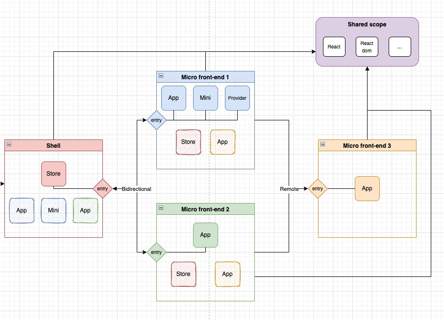

# PoC Module Federation

This Poc was created using Webpack Module Federation and have four Micro Front-ends:

1. Shell: in /shell path, run on http://localhost:3000
2. mfe-1: in /mfe-1 path, run on http://localhost:3001
3. mfe-2: in /mfe-2 path, run on http://localhost:3002
4. mfe-3: in /mfe-3 path, rub on http://localhost:3003

## Scripts

Install dependencies in all applications

`yarn bootstrap`

### In each app:

Start application

`yarn start`

Build application

`yarn build`
